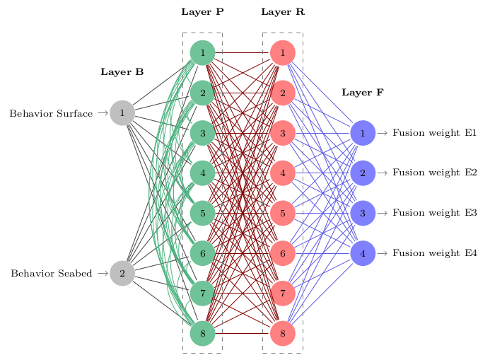

# The B-PR-F Neural Network

##Reference
Neural network for black-box fusion of underwater robot localization under unmodeled noise
Hendry Ferreira Chame, Matheus Machado dos Santos, Sílvia Silva da Costa Botelho
Robotics and Autonomous Systems, Elsevier, 2018. doi: 10.1016/j.robot.2018.08.013

#Abstract

*The research on autonomous robotics has focused on the aspect of information fusion from redundant estimates. Choosing a convenient fusion policy, that reduces the impact of unmodeled noise, and is computationally efficient, is an open research issue. The objective of this work is to study the problem of underwater localization which is a challenging field of research, given the dynamic aspect of the environment. For this, we explore navigation task scenarios based on inertial and geophysical sensory. We propose a neural network framework named B-PR-F which heuristically performs adaptable fusion of information, based on the principle of contextual anticipation of the localization signal within an ordered processing neighborhood. In the framework black-box unimodal estimations are related to the task context, and the confidence on individual estimates is evaluated before fusing information. A study conducted in a virtual environment illustrates the relevance of the model in fusing information under multiple task scenarios. A real experiment shows that our model outperforms the Kalman Filter and the Augmented Monte Carlo Localization algorithms in the task. We believe that the principle proposed can be relevant to related application fields, involving the problem of state estimation from the fusion of redundant information.*

